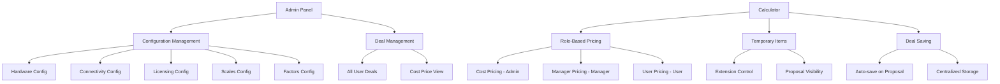

# Design Document

## Overview

This design addresses the comprehensive enhancement of the admin panel and pricing system to provide consistent role-based pricing, improved user experience, enhanced deal management, and better admin visibility. The solution builds upon the existing three-tier pricing structure (cost, manager, user) that is already implemented for hardware and extends it to all components while fixing UX issues and adding comprehensive deal management.

## Architecture

### Current State Analysis
- **Hardware**: Already has cost/managerCost/userCost structure ✓
- **Connectivity**: Has cost/managerCost/userCost structure, but pricing may not be working correctly in calculator ❌
- **Licensing**: Has cost/managerCost/userCost structure ✓
- **Scales**: Only has single pricing tier ❌
- **Factors**: Only has single factor values (decimal format like 0.02052) ❌
- **Deal Management**: Basic save/load with localStorage but no admin visibility ❌
- **Temporary Items**: Basic implementation exists but missing extension/proposal controls ❌

### Target Architecture


## Components and Interfaces

### 1. Enhanced Type Definitions

#### Extended Scales Interface
```typescript
interface EnhancedScales {
  installation: {
    cost: { [band: string]: number };
    managerCost: { [band: string]: number };
    userCost: { [band: string]: number };
  };
  finance_fee: {
    cost: { [range: string]: number };
    managerCost: { [range: string]: number };
    userCost: { [range: string]: number };
  };
  gross_profit: {
    cost: { [band: string]: number };
    managerCost: { [band: string]: number };
    userCost: { [band: string]: number };
  };
  additional_costs: {
    cost: { cost_per_kilometer: number; cost_per_point: number };
    managerCost: { cost_per_kilometer: number; cost_per_point: number };
    userCost: { cost_per_kilometer: number; cost_per_point: number };
  };
}
```

#### Enhanced Factors Interface
```typescript
interface EnhancedFactorData {
  cost: {
    [term: string]: {
      [escalation: string]: {
        [financeRange: string]: number; // Decimal values like 0.02052
      };
    };
  };
  managerFactors: {
    [term: string]: {
      [escalation: string]: {
        [financeRange: string]: number; // Decimal values like 0.02052
      };
    };
  };
  userFactors: {
    [term: string]: {
      [escalation: string]: {
        [financeRange: string]: number; // Decimal values like 0.02052
      };
    };
  };
}
```

#### Enhanced Item Interface for Temporary Items
```typescript
interface EnhancedItem extends Item {
  isTemporary?: boolean;
  showOnProposal?: boolean;
  createdBy?: string;
}
```

#### Enhanced Deal Interface
```typescript
interface EnhancedDeal {
  id: string;
  userId: string;
  username: string;
  userRole: 'admin' | 'manager' | 'user';
  customerName: string;
  sections: Section[];
  dealDetails: DealDetails;
  totals: TotalCosts;
  factors: EnhancedFactorData;
  scales: EnhancedScales;
  createdAt: string;
  updatedAt: string;
  generatedProposal?: boolean;
}
```

### 2. Admin Configuration Components

#### Enhanced ScalesConfig Component
- **Three-column pricing structure**: Cost, Manager Cost, User Cost
- **Batch save functionality**: Save all changes at once
- **Real-time validation**: Ensure manager cost ≥ cost, user cost ≥ manager cost
- **Change tracking**: Visual indicators for unsaved changes

#### Enhanced FactorSheetConfig Component
- **Three-tier factor structure**: Cost factors, Manager factors, User factors (all decimal values like 0.02052)
- **Tabbed interface**: Separate tabs for each pricing tier with consistent table layout
- **Bulk operations**: Copy cost factors to manager/user tiers with multipliers
- **Precision handling**: Support for 5-6 decimal places in factor values
- **Validation**: Ensure factor values are positive decimals

#### Enhanced Connectivity/Licensing Config
- **Debug pricing application**: Investigate and fix role-based pricing issues in calculator
- **Batch save functionality**: Save all changes at once like other config components
- **Change tracking**: Visual indicators for unsaved changes
- **Data refresh**: Ensure calculator refreshes when config changes are saved

### 3. Calculator Enhancements

#### Enhanced Temporary Item Management
```typescript
interface TemporaryItemForm {
  name: string;
  cost: number;
  isExtension: boolean; // For hardware only
  showOnProposal: boolean; // For all sections
  quantity: number;
}
```

#### Role-Based Pricing Engine
```typescript
class PricingEngine {
  static getScaleValue(scales: EnhancedScales, category: string, key: string, role: UserRole): number
  static getFactorValue(factors: EnhancedFactorData, term: number, escalation: number, amount: number, role: UserRole): number
  static getItemCost(item: EnhancedItem, role: UserRole): number
}
```

### 4. Deal Management System

#### Centralized Deal Storage
- **Enhanced localStorage**: Extend current localStorage-based deal storage
- **Role-based access**: Filter deals based on user permissions
- **Auto-save triggers**: Save on proposal generation
- **Deal metadata**: Track user context and pricing tiers used

#### Admin Deal Viewer
```typescript
interface AdminDealViewer {
  viewAllDeals(): EnhancedDeal[];
  viewDealWithCostPricing(dealId: string): EnhancedDeal;
  generateCostReport(dealId: string): CostReport;
  exportDealData(dealId: string): ExportData;
}
```

## Data Models

### 1. Migration Strategy for Existing Data

#### Scales Migration
```typescript
// Convert existing single-tier scales to three-tier
const migrateScales = (oldScales: Scales): EnhancedScales => {
  return {
    installation: {
      cost: oldScales.installation,
      managerCost: oldScales.installation, // Start with same values
      userCost: oldScales.installation
    },
    // ... similar for other categories
  };
};
```

#### Factors Migration
```typescript
// Convert existing single-tier factors to three-tier
const migrateFactors = (oldFactors: FactorData): EnhancedFactorData => {
  return {
    cost: oldFactors, // Keep existing as cost factors
    managerFactors: oldFactors, // Start with same values
    userFactors: oldFactors // Start with same values
  };
};
```

### 2. Database Schema Updates

#### Deals Table Enhancement
```sql
-- Add columns for enhanced deal tracking
ALTER TABLE deals ADD COLUMN generated_proposal BOOLEAN DEFAULT FALSE;
ALTER TABLE deals ADD COLUMN original_user_role VARCHAR(20);
ALTER TABLE deals ADD COLUMN cost_totals JSONB;
ALTER TABLE deals ADD COLUMN manager_totals JSONB;
ALTER TABLE deals ADD COLUMN user_totals JSONB;
```

#### Configuration Tables
```sql
-- Enhanced scales with role-based pricing
CREATE TABLE enhanced_scales (
  id SERIAL PRIMARY KEY,
  category VARCHAR(50),
  subcategory VARCHAR(50),
  cost_value DECIMAL(10,2),
  manager_value DECIMAL(10,2),
  user_value DECIMAL(10,2),
  updated_at TIMESTAMP DEFAULT NOW()
);

-- Enhanced factors with role-based pricing
CREATE TABLE enhanced_factors (
  id SERIAL PRIMARY KEY,
  term INTEGER,
  escalation INTEGER,
  finance_range VARCHAR(20),
  cost_factor DECIMAL(8,6),
  manager_factor DECIMAL(8,6),
  user_factor DECIMAL(8,6),
  updated_at TIMESTAMP DEFAULT NOW()
);
```

## Error Handling

### 1. Configuration Validation
- **Data integrity checks**: Validate pricing relationships (cost ≤ manager ≤ user)
- **Migration safety**: Backup existing data before migrations
- **Rollback capability**: Ability to revert to previous configurations
- **Conflict resolution**: Handle concurrent admin modifications

### 2. Calculator Error Handling
- **Pricing fallbacks**: Use cost pricing if role-specific pricing unavailable
- **Temporary item validation**: Validate temporary item data before adding
- **Deal save failures**: Retry mechanism with user notification
- **Role permission errors**: Clear error messages for unauthorized access

### 3. Deal Management Error Handling
- **Access control**: Proper error messages for unauthorized deal access
- **Data corruption**: Validation and repair for corrupted deal data
- **Export failures**: Graceful handling of PDF generation errors
- **Sync issues**: Handle offline/online state transitions

## Testing Strategy

### 1. Unit Tests
- **Pricing engine tests**: Verify correct role-based pricing calculations
- **Migration tests**: Ensure data integrity during migrations
- **Validation tests**: Test all input validation rules
- **Utility function tests**: Test helper functions for pricing and calculations

### 2. Integration Tests
- **Admin panel workflows**: Test complete configuration update flows
- **Calculator workflows**: Test deal creation with temporary items
- **Deal management workflows**: Test save/load/view operations
- **Role-based access**: Test permissions across all user roles

### 3. End-to-End Tests
- **Complete deal lifecycle**: From creation to proposal generation
- **Multi-user scenarios**: Test concurrent usage by different roles
- **Data persistence**: Test data integrity across browser sessions
- **Error recovery**: Test system behavior under error conditions

### 4. Performance Tests
- **Large dataset handling**: Test with many deals and configurations
- **Concurrent user load**: Test multiple users accessing system simultaneously
- **Database performance**: Test query performance with large datasets
- **UI responsiveness**: Test admin panel performance with large configurations

## Implementation Phases

### Phase 1: Core Infrastructure
1. **Type definitions**: Update all interfaces for enhanced pricing
2. **Migration utilities**: Create data migration functions for scales and factors
3. **Pricing engine**: Enhance role-based pricing calculations
4. **Connectivity pricing fix**: Debug and fix connectivity pricing issues in calculator

### Phase 2: Admin Panel Enhancements
1. **Scales configuration**: Implement three-tier pricing UI
2. **Factors configuration**: Implement three-tier factors UI
3. **Batch save functionality**: Implement efficient save operations
4. **Change tracking**: Add visual indicators for unsaved changes

### Phase 3: Calculator Improvements
1. **Temporary item enhancements**: Add extension and proposal controls
2. **Pricing fixes**: Fix connectivity/licensing pricing issues
3. **Role-based calculations**: Implement enhanced pricing engine
4. **UX improvements**: Improve form validation and user feedback

### Phase 4: Deal Management System
1. **Centralized storage**: Implement enhanced deal storage
2. **Admin deal viewer**: Create admin interface for all deals
3. **Auto-save triggers**: Implement automatic deal saving
4. **Cost pricing view**: Implement admin cost visibility

### Phase 5: Testing and Optimization
1. **Comprehensive testing**: Execute full test suite
2. **Performance optimization**: Optimize database queries and UI performance
3. **User acceptance testing**: Test with actual users
4. **Documentation**: Create user guides and admin documentation